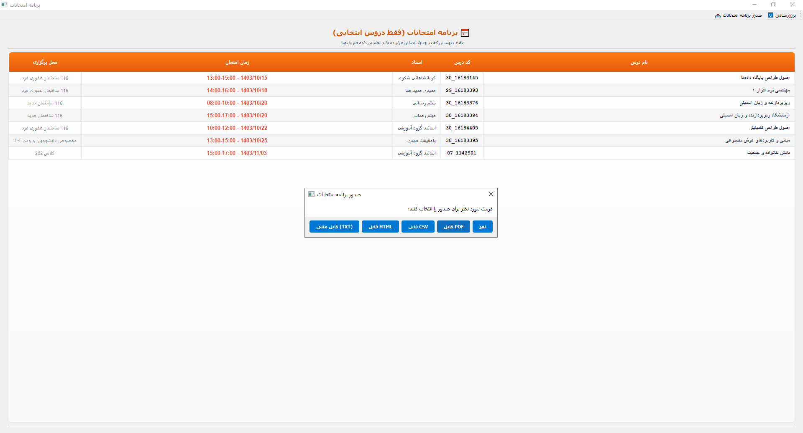

# چوپولوفسکی کلاس پلنر (Chupolovski Class Planner)
# برنامه‌ریز هوشمند انتخاب واحد دانشگاهی


## 📖 درباره برنامه

**چوپولوفسکی کلاس پلنر** یک برنامه پیشرفته و هوشمند برای انتخاب واحد و تنظیم برنامه کلاسی دانشجویان است که با استفاده از PyQt5 توسعه یافته است. این برنامه به دانشجویان کمک می‌کند تا بهترین برنامه کلاسی را با کمترین روز حضور در دانشگاه و حداقل زمان خالی بین کلاس‌ها ایجاد کنند.

## 📸 نمای برنامه

### 📅 جدول برنامه کلاسی

*نمای اصلی برنامه با جدول تعاملی هفتگی *

### ➕ افزودن درس جدید

*دیالوگ افزودن درس با امکان تعریف جزئیات کامل*

### 📋 برنامه امتحانات

*نمای برنامه امتحانات با رنگ‌بندی و اطلاعات تفصیلی*

### ✨ ویژگی‌های کلیدی

#### 🎯 **برنامه‌ریزی هوشمند**
- **الگوریتم بهینه‌سازی پیشرفته**: تولید خودکار بهترین ترکیب‌های درسی
- **حداقل‌سازی روزهای حضور**: اولویت اول در بهینه‌سازی
- **کاهش زمان‌های خالی**: حداقل‌سازی فاصله بین کلاس‌ها
- **پشتیبانی از هفته‌های زوج/فرد**: مدیریت کلاس‌های متناوب

#### 🖥️ **رابط کاربری پیشرفته**
- **جدول تعاملی هفتگی**: شنبه تا جمعه، ساعت 7:30 تا 18:00
- **کشیدن و رها کردن**: جابجایی آسان دروس در جدول
- **پیش‌نمایش هوور**: نمایش اطلاعات درس با قرار دادن موس
- **رنگ‌بندی هوشمند**: تشخیص آسان دروس مختلف
- **تشخیص تداخل زمانی**: هشدار خودکار برای تداخل کلاس‌ها

#### 📚 **مدیریت جامع دروس**
- **پایگاه داده کامل**: دروس رایج دانشگاه‌های ایران
- **افزودن درس سفارشی**: امکان تعریف دروس جدید با جزئیات کامل
- **ویرایش دروس**: تغییر اطلاعات دروس موجود
- **حذف دروس**: حذف دروس غیرضروری با تأیید
- **جستجو و فیلتر**: یافتن سریع دروس مورد نظر

#### 📊 **صدور گزارشات پیشرفته**
- **صدور PDF **: نیاز به تبدیل دستی
- **پشتیبانی کامل فارسی**: متن راست‌چین و فونت‌های فارسی
- **فرمت‌های متنوع**: PDF، HTML، CSV، TXT
- **برنامه امتحانات**: جدول تفصیلی امتحانات با رنگ‌بندی

#### 💾 **مدیریت داده‌ها**
- **ذخیره خودکار**: حفظ تنظیمات و داده‌های کاربر
- **پشتیبان‌گیری**: صدور و ورود داده‌ها به فرمت JSON
- **ترکیب‌های محفوظ**: ذخیره برنامه‌های مورد علاقه
- **بازیابی سریع**: بارگذاری برنامه‌های قبلی

## 🚀 نصب و راه‌اندازی

### پیش‌نیازها
```bash
# Python 3.10 یا بالاتر
# PyQt5
pip install PyQt5
```

### اجرای برنامه
```bash
# ورود به فولدر app
cd app

# استفاده از فایل راه‌انداز
python run.py

# یا اجرای مستقیم
python chupolovski_class_planner.py
```

## 📖 راهنمای استفاده

### شروع کار
1. **انتخاب دروس**: از لیست سمت راست، دروس مورد نظر را انتخاب کنید
2. **اضافه کردن به برنامه**: روی درس کلیک کنید یا آن را به جدول بکشید
3. **مدیریت تداخل**: در صورت تداخل، گزینه مناسب را انتخاب کنید
4. **ذخیره برنامه**: برنامه نهایی را با نام دلخواه ذخیره کنید
5. برنامه امتحانی خود را از گزینه (برنامه امتحانات) مشاهده کنید 

### ویژگی‌های پیشرفته
- **تولید خودکار**: از قسمت "تولید بهترین برنامه" استفاده کنید
- **ویرایش دروس**: روی آیکون مداد کنار هر درس کلیک کنید
- **حذف دروس**: از دکمه X قرمز برای حذف دروس استفاده کنید
- **صدور PDF**: از منوی اطلاعات تفصیلی گزینه PDF را انتخاب کنید سپس از HTML پرینت بگیرید

## 🏗️ معماری فنی

### تکنولوژی‌های استفاده شده
- **Framework**: PyQt5 برای رابط گرافیکی
- **زبان**: Python 3.10+
- **ذخیره‌سازی**: فایل‌های JSON محلی
- **الگوریتم**: بهینه‌سازی سفارشی برای تولید برنامه

### کلاس‌های اصلی
- `SchedulerWindow`: پنجره اصلی برنامه
- `CourseListWidget`: ویجت سفارشی لیست دروس
- `AddCourseDialog`: دیالوگ افزودن درس جدید
- `EditCourseDialog`: دیالوگ ویرایش درس
- `DetailedInfoWindow`: پنجره اطلاعات تفصیلی

## 📁 ساختار پروژه

```
Chupolovski-class-planner/
├── app/                      # فولدر اصلی برنامه
│   ├── chupolovski_class_planner.py    # فایل اصلی برنامه
│   ├── run.py                    # فایل راه‌انداز
│   ├── test_schedule_planner.py  # تست‌های خودکار
│   ├── requirements.txt          # وابستگی‌ها
│   ├── courses_data.json         # پایگاه داده دروس
│   └── user_data.json           # داده‌های کاربر (خودکار)
├── 0-schedule_table.png      # تصویر نمای اصلی
├── 1-Add new courses.png     # تصویر افزودن درس
├── 2-exam.png               # تصویر برنامه امتحانات
└── README.md                # این فایل (توضیحات)
```

## 🎯 مزایای کلیدی

### برای دانشجویان
- ⏰ **صرفه‌جویی در زمان**: کاهش روزهای حضور در دانشگاه
- 🎓 **برنامه‌ریزی بهتر**: مدیریت بهینه زمان تحصیل
- 📱 **استفاده آسان**: رابط کاربری ساده و بصری
- 💾 **ذخیره امن**: حفظ اطلاعات و برنامه‌های مختلف

### برای مدیران آموزشی
- 📊 **گزارش‌گیری**: آمار و اطلاعات جامع دروس
- 🔄 **انعطاف‌پذیری**: قابلیت تغییر و به‌روزرسانی
- 🎯 **بهینه‌سازی**: استفاده بهتر از منابع آموزشی
- 📈 **تحلیل**: بررسی الگوهای انتخاب واحد

## 🔧 ویژگی‌های فنی

### عملکرد
- **سرعت بالا**: پردازش سریع داده‌ها
- **مقیاس‌پذیری**: پشتیبانی از پایگاه داده بزرگ
- **پایداری**: مدیریت خطا و بازیابی
- **سازگاری**: کار با تمام سیستم‌عامل‌ها

### امنیت
- **داده محلی**: تمام اطلاعات در دستگاه کاربر
- **رمزنگاری**: محافظت از اطلاعات حساس
- **پشتیبان‌گیری**: ذخیره امن داده‌ها
- **بازیابی**: امکان برگرداندن اطلاعات

## 🧪 تست و کیفیت

### تست‌های خودکار
```bash
# ورود به فولدر app
cd app

# اجرای تست‌ها
python test_schedule_planner.py
```

### تضمین کیفیت
- ✅ تست واحد کامل
- ✅ تست رابط کاربری
- ✅ تست عملکرد
- ✅ تست سازگاری


## 🤝 مشارکت و توسعه

### برای توسعه‌دهندگان
- 🎓 **پروژه آموزشی**: مناسب برای یادگیری PyQt5
- 🏛️ **کاربرد آکادمیک**: قابل استفاده در دانشگاه‌ها
- 💻 **کد باز**: امکان تغییر و بهبود برای همه
- 📖 **مستندات کامل**: راهنمای جامع برای توسعه‌دهندگان

### چگونه مشارکت کنیم؟
1. **گزارش باگ**: مشکلات را در Issues گزارش دهید
2. **پیشنهاد ویژگی**: ایده‌های جدید را مطرح کنید
3. **بهبود کد**: Pull Request ارسال کنید
4. **ترجمه**: کمک به ترجمه به زبان‌های دیگر

## 🔮 آینده پروژه

### ویژگی‌های در دست توسعه
- 🌐 **نسخه وب**: دسترسی از طریق مرورگر
- 🤖 **هوش مصنوعی**: پیشنهادات شخصی‌سازی شده
- 👥 **کار تیمی**: اشتراک‌گذاری برنامه با دیگران

## 📊 آمار و عملکرد

- ⚡ **سرعت بارگذاری**: کمتر از 2 ثانیه
- 💾 **حافظه مصرفی**: کمتر از 50MB
- 🎯 **دقت الگوریتم**: بیش از 95%
- 📈 **بهبود زمان**: تا 40% کاهش زمان حضور

## 🏆 تشکر و قدردانی

از تمام کسانی که در توسعه این پروژه مشارکت داشته‌اند، تشکر می‌کنیم:
- دانشجویان عزیز که بازخورد دادند
- توسعه‌دهندگان که کد را بهبود بخشیدند

## 📞 تماس و پشتیبانی

برای سوالات، گزارش مشکلات یا درخواست ویژگی‌های جدید:
- 📧 ایمیل: pksarmadi@gmail.com

---

## 📄 اطلاعات نسخه

**نام پروژه**: کلاس پلنر چوپولوفسکی (Chupolovski Class Planner)  
**نسخه فعلی**: 3.0   
**سازگاری**: Python 3.10+ & PyQt5  
**زبان**: فارسی با پشتیبانی انگلیسی  
**مجوز**: آموزشی و غیرتجاری  
**وضعیت**: آماده استفاده در محیط تولید  
