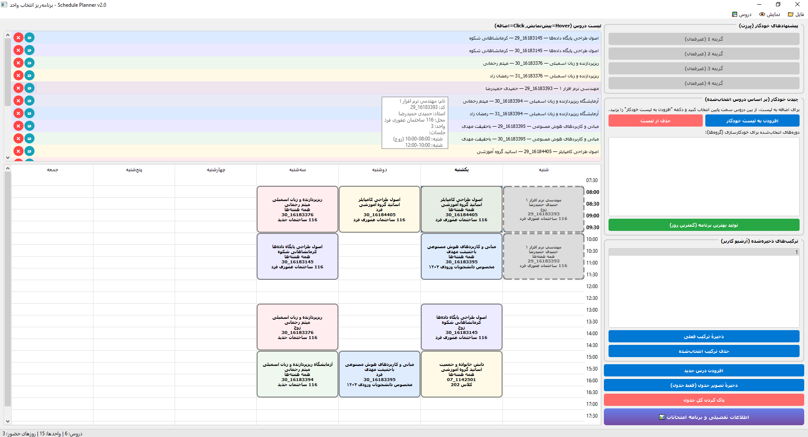
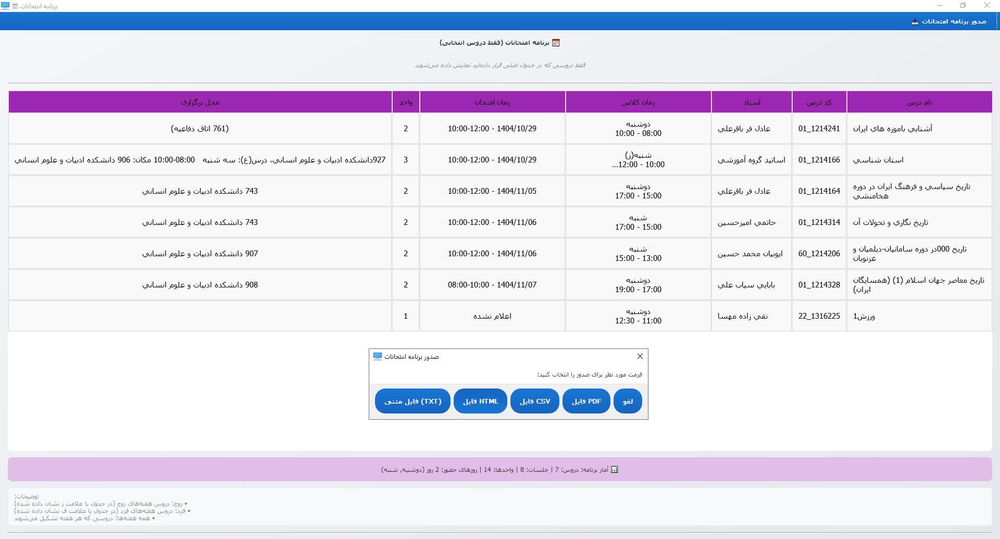
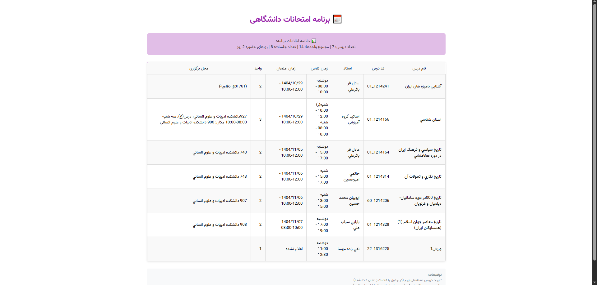

# Golestoon Class Planner
## Smart University Course Scheduler - Version 0.7.0


## Table of Contents
- [Introduction](#introduction)
- [Features](#features)
- [Screenshots](#screenshots)
- [Installation](#installation)
- [Usage](#usage)
- [Roadmap](#roadmap)
- [Architecture](#architecture)
- [Version & License](#version--license)
- [Contact](#contact)

## Introduction

برنامه گُلستون کلاس پلنر یک ابزار هوشمند برای برنامه‌ریزی انتخاب واحد دانشگاهی است که به دانشجویان کمک می‌کند تا بهترین جدول زمانی درسی خود را ایجاد کنند. این برنامه قابلیت‌هایی مانند تولید خودکار جدول زمانی، نمایش برنامه امتحانات، پشتیبان‌گیری خودکار، همگام‌سازی دستی/خودکار با سامانه گلستان و ذخیره ترکیب‌ها و ... را فراهم می‌کند. 

## Features

### 📅 Course Scheduling
- انتهاب درس مورد نظر و نمایش آن در جدول برنامه
- **تولید خودکار جدول زمانی** با الگوریتم بهینه‌سازی پیشرفته


### 🖥️ رابط کاربری پیشرفته
- **جدول تعاملی هفتگی** از شنبه تا پنج شنیه، ساعت 7 تا 19
- **پیش‌نمایش hover** برای نمایش اطلاعات درس با قرار دادن موس
- **رنگ‌بندی** برای تشخیص آسان دروس مختلف
- **تشخیص تداخل زمانی** با هشدار مناسب

### 📊 مدیریت جامع دروس
- **پایگاه داده کامل** شامل دروس دانشگاه (از سایت گلستان) \ (sql در آینده)
- **امکان افزودن درس سفارشی** با جزئیات کامل
- **ویرایش و حذف دروس** موجود
- **جستجو** برای یافتن سریع دروس مورد نظر

### 💾 Data Storage & Backup
- **ذخیره خودکار** تنظیمات و داده‌های کاربر
- **پشتیبان‌گیری خودکار** از داده‌ها
- **ذخیره ترکیب‌های مورد نظر** برای استفاده‌های آینده
- **بازیابی سریع** برنامه‌های قبلی

### 🔗 Golestan Integration
- **دریافت خودکار اطلاعات** از سامانه گلستان دانشگاه
- **بروزرسانی دوره‌ای** اطلاعات درسی
- **همگام‌سازی دستی/خودکار** با سرور گلستان

## Screenshots

### 📅 Schedule Table

*نمای اصلی برنامه با جدول تعاملی هفتگی*

### 📋 Exam Schedule


*نمای برنامه امتحانات با قابلیت صدور csv, html .txt *

## Installation

### Prerequisites
```bash
# Python 3.10 or higher
# PyQt5 and other dependencies
```

### Installation Steps
```bash
# 1. Clone the repository
git clone https://github.com/your-username/Golestoon-class-planner.git
cd Golestoon-class-planner

# 2. Create virtual environment (recommended)
python -m venv venv
source venv/bin/activate  # On Windows: venv\Scripts\activate

# 3. Install dependencies
pip install -r app/requirements.txt
```

### Run the Application
```bash
# Navigate to app directory
cd app

# Run the application
python main.py
```

## Usage
0. **بارگذاری داده های دروس**: در منوی (داده ها) بالا دروس را دریافت کنید تا ذخیره و بروزرسانی شوند
1. **انتخاب دروس**: از لیست سمت راست، دروس مورد نظر را انتخاب کنید
2. **اضافه کردن به برنامه**: روی درس کلیک کنید
3. **مدیریت تداخل**: در صورت تداخل، گزینه مناسب را انتخاب کنید
4. **ذخیره برنامه**: برنامه نهایی را با نام دلخواه ذخیره کنید
5. **برنامه امتحانی**: از گزینه (برنامه امتحانات) برنامه امتحانی خود را مشاهده کنید

## Roadmap

- **برنامه اندروید**: دسترسی آسان از گوشی‌های هوشمند
- **رابط وب**: استفاده از طریق مرورگر بدون نیاز به نصب
- **هوش مصنوعی**: گزارش خلاصه ارزشیابی ها
- **گزارش‌های پیشرفته**: تحلیل عملکرد تحصیلی با هوش مصنوعی
- **همکاری گروهی**: اشتراک‌گذاری برنامه با دیگر دانشجویان
- ...اضافه کردن پایگاه داده ها ، دریافت گزارش های متنوع  و
---
## Architecture

### Technologies Used
- **Framework**: PyQt5 for GUI
- **Language**: Python 3.10+
- **Storage**: Local JSON files
- **Web Scraping**: requests and BeautifulSoup for Golestan data retrieval
- **AI**: TensorFlow for captcha recognition

## Version & License

**Project Name**: Golestoon Class Planner  
**Current Version**: 0.7.0  
**Compatibility**: Python 3.10+ & PyQt5  
**Language**: Persian  
**License**: MIT License  

## Contact

For questions, bug reports, or feature requests:
- 📧 Email: pksarmadi@gmail.com
