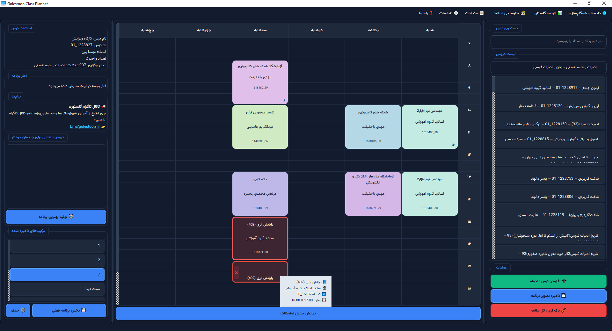
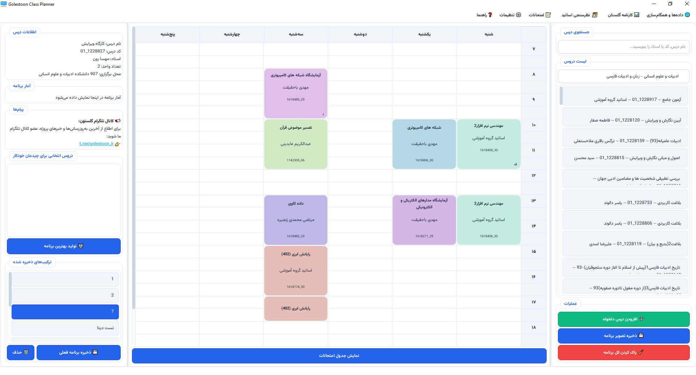
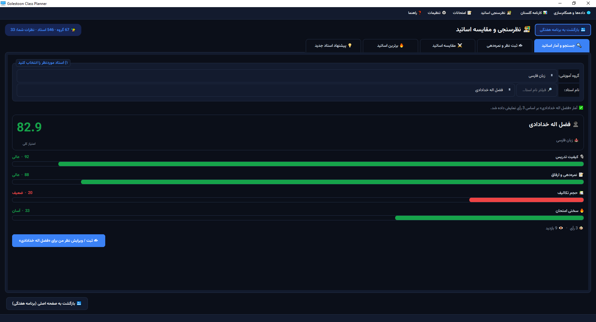
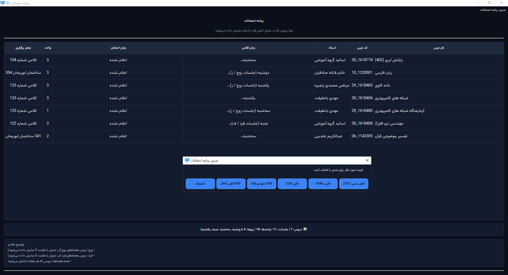

# Golestoon — Smart University Course Scheduler 🌸


نسخه‌ی دسکتاپِ سامانه‌ی انتخاب واحد و برنامه‌ریزی درسی دانشگاهی **[گلستون (Golestoon)](https://golestoon-app.ir)**.
این برنامه به دانشجویان کمک می‌کند تا با سرعتی بالا، برنامه‌ی هفتگی ایده‌آل خود را بچینند، تداخل‌های زمانی و امتحانی را در لحظه بسنجند، کارنامه و پیشرفت تحصیلی خود را دنبال کنند و نظرسنجی و مقایسه اساتید را بررسی نمایند.

---

## 📸 پیش‌نمایش محیط برنامه (Screenshots)

برای مشاهده ظاهر مدرن و امکانات برنامه:

|        برنامه هفتگی (تم تیره Slate)        |            برنامه هفتگی (تم روشن)            |
| :---------------------------------------------------------: | :-----------------------------------------------------------: |
|  |  |

| نظرسنجی و مقایسه اساتید (تعبیه‌شده) |
| :--------------------------------------------------------------: |
|            |

| جدول زمان‌بندی امتحانات و خروجی‌ها |
| :--------------------------------------------------------------: |
|                    |

---

## 📑 فهرست مطالب (Table of Contents)

- [امکانات و قابلیت‌ها](#-امکانات-و-قابلیت‌ها)
- [نحوه عملکرد: حالت ابری و اسکرپر داخلی](#-نحوه-عملکرد-حالت-ابری-و-اسکرپر-داخلی)
- [پیکربندی متغیرهای محیطی (`.env`)](#-پیکربندی-متغیرهای-محیطی-env)
- [پیش‌نیازها و نصب](#-پیش‌نیازها-و-نصب)
- [راهنمای استفاده از برنامه](#-راهنمای-استفاده-از-برنامه)
- [نکات فنی و معماری برای برنامه‌نویسان](#-نکات-فنی-و-معماری-برای-برنامه‌نویسان)
- [مشارکت در توسعه (Contributing &amp; PR)](#-مشارکت-در-توسعه-contributing--pr)
- [امنیت و حریم خصوصی](#-امنیت-و-حریم-خصوصی)
- [ارتباط و پشتیبانی](#-ارتباط-و-پشتیبانی)

---

## ✨ امکانات و قابلیت‌ها

### 📅 برنامه‌ریزی هفتگی و چیدمان تعاملی

- **جدول زمانی پویا:** پوشش ساعات ۷:۰۰ صبح الی ۲۰:۰۰ عصر از شنبه تا پنج‌شنبه با هدرهای دقیق و تمیز.
- **پشتیبانی از جلسات زوج / فرد (Parity):** چیدمان همزمان دروس فرد و زوج بر روی یک اسلات مشترک با ویجت‌های دوگانه (Dual Widget).
- **بهینه‌سازی جلسات کوتاه:** نمایش هوشمند و خوانای جلسات ۱ ساعته بدون به‌هم‌ریختگی متن.
- **حذف سریع و تعاملی:** نمایش دکمه حذف (ضربدر) تنها در زمان Hover روی جلسه برای حفظ خلوتی و زیبایی بصری جدول.
- **تشخیص تداخل هوشمند:** شناسایی فوری هم‌پوشانی زمانی کلاس‌ها و تقاطع ساعات امتحانی.
- **ترکیب‌های ذخیره‌شده (Saved Combinations):** امکان ذخیره ترکیبات مختلف روی دیتابیس لوکال و ابری، با امکان جایگزینی و چیدمان آنی با یک کلیک.

### 🎓 داشبورد تحصیلی و کارنامه دانشجو

- **یکپارچه‌سازی درون پنجره اصلی:** باز شدن کارنامه و داشبورد مستقیماً روی صفحه اصلی با دکمه بازگشت و کلید `Esc` (بدون پاپ‌آپ‌های مزاحم).
- **گزارش ۲۷۲ گلستان:** نمایش پیشرفت واحدهای گذرانده‌شده به تفکیک دروس عمومی، پایه، تخصصی و اختیاری همراه با نوار پیشرفت درصدی.
- **نمودار روند معدل:** نمودار خطی تحلیلی معدل ترمی و کل.
- **فیلتر ترمیک و تفکیک دروس:** فیلتر دروس بر اساس نیم‌سال و وضعیت قبولی/مردودی.

### 👨‍🏫 نظرسنجی و مقایسه اساتید (معادل نسخه وب)

- **دایرکتوری جامع اساتید:** جستجو و مشاهده آمار تفصیلی اساتید بر اساس گروه‌های آموزشی دانشگاه.
- **شاخص‌های چندگانه:** میانگین کیفیت تدریس، نمره‌دهی و ارفاق، حجم تکالیف و سختی امتحانات به همراه تحلیل وزنی آرا.
- **مقایسه همزمان:** مقایسه همزمان ۲ الی ۳ استاد در یک نگاه.
- **ثبت نظر کاملاً ناشناس:** امکان ثبت، ویرایش و حذف نظر با رعایت درگاه Give-to-Get.
- **پیشنهاد استاد جدید:** فرم پیشنهاد اضافه شدن اساتید جدید به سامانه.

### 📝 زمان‌بندی امتحانات و خروجی‌های چندگانه

- **تقویم امتحانی:** مرتب‌سازی خودکار کارت‌های امتحانی بر اساس تاریخ و ساعت و هایلایت تداخل امتحانات.
- **خروجی‌های متنوع:**
  - ذخیره تصویر جدول برنامه هفتگی (با وضوح بالا برای اشتراک‌گذاری)
  - خروجی PDF استاندارد
  - خروجی جدول وب (HTML)
  - خروجی داده خام (CSV)

### 🎨 تم‌های مدرن و پشتیبانی چندزبانه (i18n)

- **تم‌های Slate حرفه‌ای:** حالت تاریک (Dark)، حالت روشن (Light) و هم‌گام با سیستم (System) با تغییر آنی رنگ‌بندی تمام اجزا.
- **دو زبانه کامل:** پشتیبانی سراسری از زبان‌های **فارسی (RTL)** و **انگلیسی (LTR)** با ذخیره‌سازی ترجیحات کاربر.

---

## ⚙️ نحوه عملکرد: حالت ابری و اسکرپر داخلی

یکی از ویژگی‌های متمایز گلستون، **معماری دوگانه و انعطاف‌پذیر** آن است:

```
                  ┌────────────────────────────────────────┐
                  │          Golestoon Desktop UI          │
                  └───────────────────┬────────────────────┘
                                      │
            ┌─────────────────────────┴─────────────────────────┐
            ▼                                                   ▼
┌───────────────────────┐                           ┌───────────────────────┐
│   حالت ابری (Cloud)    │                           │  حالت مستقل (Local)   │
├───────────────────────┤                           ├───────────────────────┤
│ • اتصال به REST API    │                           │ • اسکرپر داخلی گلستان │
│ • سینک آنلاین دروس    │                           │ • حل کپچا با AI/OCR   │
│ • همگام‌سازی ترکیبات   │                           │ • دیتابیس SQLite محلی │
│ • دسترسی به نظرسنجی   │                           │ • کارکرد آفلاین کامل  │
└───────────────────────┘                           └───────────────────────┘
```

1. **حالت ابری (Cloud API Mode):**
   - در صورت تنظیم متغیر `GOLESTOON_API_BASE_URL` در فایل `app/.env`، برنامه به سرور متصل شده و تمامی امکانات شامل **کاتالوگ سریع دروس، همگام‌سازی ابری ترکیبات و سیستم جامع نظرسنجی اساتید** را از طریق REST API امن و بدون بار اضافی بر روی سیستم کاربر ارائه می‌دهد.
   - 🔒 **نکته امنیتی دسترسی به API:** به منظور حفظ امنیت و مدیریت دسترسی‌ها، آدرس سرور اصلی در ریپازیتوری عمومی منتشر نشده است. **توسعه‌دهندگانی که مایل به همکاری در پروژه هستند می‌توانند از طریق ایمیل یا Issue در گیت‌هاب با مدیر پروژه ارتباط برقرار کنند تا اندپوینت مربوطه برای آن‌ها ارسال شود.**

2. **حالت مستقل و آفلاین (Local Scraper & Standalone Mode):**
   - در صورت خالی بودن یا عدم تنظیم متغیر `GOLESTOON_API_BASE_URL`، برنامه به صورت ۱۰۰٪ محلی و آفلاین فعالیت می‌کند:
     - **عدم ارسال داده به سرور ابری:** هیچ‌گونه اطلاعات یا تغییری به سرور ابری منتقل نمی‌شود.
     - **استخراج خودکار اساتید:** لیست اساتید و دانشکده‌ها مستقیماً از دروس موجود در دیتابیس محلی استخراج و در بخش نظرسنجی و مقایسه نمایش داده می‌شوند.
     - **اسکرپر و هوش مصنوعی محلی:** دریافت مستقیم دروس و کارنامه از سامانه گلستان با وارد کردن شماره دانشجویی و رمز عبور از طریق اسکرپر بومی (`app/scrapers/`) و ماژول حل هوشمند کپچا (`app/captcha_solver/`).
     - **دیتابیس SQLite محلی:** کلیه دروس، سوابق و ترکیب‌های هفتگی در رایانه کاربر ذخیره و مدیریت می‌شوند.

---

## 🔑 پیکربندی متغیرهای محیطی (`.env`)

> ⚠️ **نکته بسیار مهم برای کاربران و توسعه‌دهندگان:**
> فایل تنظیمات محیطی **باید** در مسیر `app/.env` وجود داشته باشد. برای شروع کافی است فایل نمونه `app/.env.example` را کپی کنید:

```bash
# در پوشه اصلی پروژه:
cp app/.env.example app/.env
```

### متغیرهای کلیدی در `app/.env`:

| متغیر                 | توضیح                                                                                                                                                           | وضعیت / مقدار پیشنهادی                      |
| :------------------------- | :------------------------------------------------------------------------------------------------------------------------------------------------------------------- | :--------------------------------------------- |
| `GOLESTOON_API_BASE_URL` | *(اختیاری)* آدرس REST API گلستون جهت فعال‌سازی حالت ابری (جهت دریافت آدرس به توسعه‌دهنده پیام دهید) | خالی (فعال‌سازی حالت محلی آفلاین) |
| `CAPTCHA_API_URL`        | *(اختیاری)* آدرس API ابری حل کپچا جهت اجرای فوق‌سبک و ساخت خروجی exe بدون کتابخانه سنگین TensorFlow | خالی (فال‌بک به مدل لوکال) |
| `GOLESTOON_LOG_LEVEL`    | سطح لاگ برنامه (`DEBUG`, `INFO`, `WARNING`, `ERROR`)                                                                                             | `INFO`                                       |
| `USERNAME`               | *(اختیاری - صرفاً جهت راحتی توسعه محلی)* شماره دانشجویی گلستان                                                     | خالی (درخواست از طریق محیط برنامه) |
| `PASSWORD`               | *(اختیاری - صرفاً جهت راحتی توسعه محلی)* رمز عبور گلستان                                                                 | خالی (درخواست از طریق محیط برنامه) |

---

## 🚀 پیش‌نیازها و نصب

### پیش‌نیازها

- **Python:** نسخه `3.10` یا بالاتر
- **سیستم‌عامل:** ویندوز ۱۰ / ۱۱ (پشتیبانی پایه از لینوکس و مک نیز فراهم است)
- **Git**

### مراحل نصب و اجرا

```bash
# ۱. دریافت ریپازیتوری
git clone https://github.com/Pezhm4n/Chupolovski-class-planner.git
cd Golestoon-class-planner

# ۲. ایجاد و فعال‌سازی محیط مجازی پایتون (توصیه اکید)
python -m venv venv

# ویندوز (PowerShell یا CMD):
venv\Scripts\activate

# لینوکس یا مک:
# source venv/bin/activate

# ۳. نصب پکیج‌ها و وابستگی‌ها
pip install -r app/requirements.txt

# ۴. آماده‌سازی فایل .env
cp app/.env.example app/.env

# ۵. اجرای برنامه
python app/main.py
```

---

## 📖 راهنمای استفاده از برنامه

1. **دریافت کاتالوگ دروس:**از منوی بالای صفحه، گزینه «داده‌ها و همگام‌سازی» → «دریافت آنلاین دروس» را انتخاب کنید (یا از کش محلی استفاده نمایید).
2. **انتخاب و افزودن درس به جدول:**در پنل سمت راست، رشته مورد نظر را فیلتر کرده یا نام/کد درس را جستجو کنید. با کلیک بر روی هر درس، جلسات آن بلافاصله روی جدول زمانی قرار می‌گیرد.
3. **مشاهده اطلاعات و حذف درس:**
   - برای مشاهده جزئیات کامل درس، روی سلول درس در جدول کلیک کنید.
   - برای حذف سریع، نشانگر موس را روی جلسه ببرید و روی دکمه `✕` قرمز کلیک کنید.
4. **کارنامه و گزارش ۲۷۲:**از منوی «کارنامه گلستان» استفاده کنید تا صفحه تحلیل تحصیلی باز شود. برای بازگشت به جدول، دکمه `🔙 بازگشت به برنامه هفتگی` یا کلید `Esc` را بزنید.
5. **نظرسنجی و اساتید:**از منوی «نظرسنجی اساتید» وارد بخش بررسی اساتید شوید و اساتید گروه‌های مختلف را مقایسه کنید.
6. **ذخیره و بازیابی:**
   برنامه نهایی خود را در پنل «ترکیب‌های ذخیره‌شده» نام‌گذاری و ذخیره کنید تا هم روی سیستم و هم روی اکانت ابری شما در دسترس باشد.

---

## 🛠 نکات فنی و معماری برای برنامه‌نویسان

پروژه با رعایت اصول ماژولار، کد تمیز و ساختار چندلایه‌ای طراحی شده است:

```
Golestoon-class-planner/
├── app/
│   ├── assets/              # فونت‌ها، آیکون‌ها و تصاویر ثابت
│   ├── captcha_solver/      # مدل هوش مصنوعی و پردازش تصویر حل کپچای گلستان
│   ├── core/                # موتورها، مدل‌ها و لاجیک مرکزی
│   │   ├── auth/            # مدیریت توکن و احراز هویت
│   │   ├── network/         # مدیریت Session، کلاینت‌های REST و اتصال
│   │   ├── academic_manager.py
│   │   ├── professor_manager.py
│   │   ├── schedule_engine.py
│   │   ├── theme_manager.py
│   │   └── language_manager.py
│   ├── data/                # داده‌های محلی، بکاپ‌های اتوماتیک و کش JSON
│   ├── scrapers/            # کدهای استخراج و خزش گلستان
│   ├── translations/        # فایل‌های دیکشنری زبان (fa_IR.json / en_US.json)
│   ├── ui/                  # ویجت‌ها، دیالوگ‌ها، صفحات QStackedWidget و کنترلرها
│   ├── .env.example         # الگوی تنظیمات متغیرهای محیطی
│   ├── main.py              # نقطه ورود اجرایی کلاینت
│   └── requirements.txt     # پکیج‌های پایتونی پروژه
├── tests/                   # تست‌های خودکار یکپارچگی و رگرسیون
├── README.md
└── SECURITY.md
```

### نکات کلیدی معماری:

- **نخ‌های پس‌زمینه (Non-blocking UI with QThread):** تمام ارتباطات شبکه، استخراج اسکرپر و پردازش‌های سنگین در کارگرهای مجزای `QThread` اجرا می‌شوند تا از هرگونه فریز یا هنگ کردن پنجره اصلی جلوگیری شود.
- **رابط یکپارچه بر پایه `QStackedWidget`:** به جای استفاده از دیالوگ‌های بازشونده مکرر، بخش‌های بزرگ (کارنامه، نظرسنجی و جدول) به صورت صفحات داخلی یکپارچه طراحی شده‌اند.
- **کنترل همروندی و Debouncing:** صف‌بندی عملیات با `course_addition_queue` و تایمرهای Debounce مانع از Race Condition در کلیک‌های سریع می‌شود.
- **همگام‌سازی دوطرفه داده‌ها (`resolve_or_register_course`):** الگوریتم تطابق چندمعیاره تضمین می‌کند که داده‌های ذخیره‌شده در وب یا دیتابیس با پسوندهای مختلف دسکتاپ سازگار باشند.

---

## 🤝 مشارکت در توسعه (Contributing & PR)

از تمامی مشارکت‌ها، گزارش باگ‌ها، پیشنهاد ویژگی‌های جدید و ارسال Pull Request به‌گرمی استقبال می‌شود! 🌸

### نحوه مشارکت:

1. این ریپازیتوری را **Fork** کنید.
2. یک شاخه (Branch) جدید برای ویژگی یا رفع باگ خود بسازید:
   ```bash
   git checkout -b feature/amazing-feature
   ```
3. تغییرات خود را با کامیت‌های منظم و معنادار (بر اساس [Conventional Commits](https://www.conventionalcommits.org/)) ثبت کنید:
   ```bash
   git commit -m "feat(schedule): add conflict export in ical format"
   ```
4. شاخه خود را به گیت‌هاب Push کنید:
   ```bash
   git push origin feature/amazing-feature
   ```
5. یک **Pull Request** جدید روی شاخه `main` باز کنید و توضیحات تغییرات را بنویسید.

---

## 🔒 امنیت و حریم خصوصی

- این ریپازیتوری کلاینت نرم‌افزار است و هیچ‌گونه کلید امنیتی حساس، سکرت‌های سرور یا رمز عبور در کدهای آن وجود ندارد.
- رمزهای عبور و اطلاعات سامانه گلستان شما تنها به صورت محلی و رمزنگاری‌شده در سیستم خودتان نگهداری شده و فقط با پروتکل HTTPS به اندپوینت‌های مجاز ارسال می‌شود.
- برای گزارش آسیب‌پذیری‌های امنیتی، لطفاً مستقیماً از طریق دستورالعمل موجود در [SECURITY.md](SECURITY.md) اقدام نمایید.

---

## 📬 ارتباط و پشتیبانی

- 🌐 **وب‌سایت رسمی:** [golestoon-app.ir](https://golestoon-app.ir)
- 📢 **کانال تلگرام گلستون:** [t.me/golestoon_ir](https://t.me/golestoon_ir)
- 📧 **ایمیل:** [pksarmadi@gmail.com](mailto:pksarmadi@gmail.com)
- 🐛 **گزارش باگ / مشکلات:** [GitHub Issues](https://github.com/Pezhm4n/Chupolovski-class-planner/issues)
